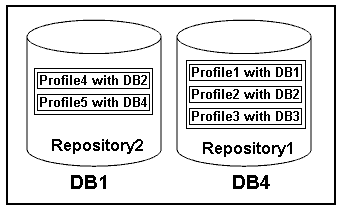

= 什么是配置文件
:allow-uri-read: 
:icons: font
:imagesdir: ../media/

[role="lead"]
SnapManager 使用配置文件存储对给定数据库执行操作所需的信息。配置文件包含有关数据库的信息，包括其凭据，备份和克隆。通过创建配置文件，您不必在每次对该数据库执行操作时都指定数据库详细信息。

一个配置文件只能引用一个数据库。同一数据库可以由多个配置文件引用。使用一个配置文件创建的备份无法从其他配置文件访问，即使这两个配置文件都引用同一数据库也是如此。

配置文件信息存储在存储库中。存储库包含数据库的配置文件信息以及用作数据库备份的 Snapshot 副本的相关信息。实际 Snapshot 副本存储在存储系统上。Snapshot 副本名称存储在包含该数据库的配置文件的存储库中。对数据库执行操作时，必须从存储库中选择配置文件。

下图说明了存储库如何可以包含多个配置文件，但每个配置文件只能定义一个数据库：

在上述示例中， Repository2 位于数据库 DB1 上，而 Repository1 位于数据库 DB4 上。

每个配置文件都包含与该配置文件关联的数据库的凭据。通过这些凭据， SnapManager 可以连接到数据库并使用该数据库。存储的凭据包括用于访问主机，存储库，数据库的用户名和密码对，以及使用 Oracle Recovery Manager （ RMAN ）时所需的连接信息。

您无法访问使用不同配置文件中的一个配置文件创建的备份，即使这两个配置文件都与同一数据库相关联也是如此。SnapManager 会锁定数据库，以防止同时执行两个不兼容的操作。

* 用于创建完整备份和部分备份的配置文件 *

您可以创建配置文件来执行完整备份或部分备份。

您为创建完整备份和部分备份而指定的配置文件既包含数据文件，又包含归档日志文件。SnapManager 不允许此类配置文件将归档日志备份与数据文件备份分开。完整和部分备份会根据现有备份保留策略保留，并根据现有保护策略进行保护。您可以根据适合自己的时间和频率计划完整备份和部分备份。

* 用于创建仅数据文件备份和仅归档日志备份的配置文件 *

使用 SnapManager （ 3.2 或更高版本），您可以创建配置文件，以便将归档日志文件的备份与数据文件分开。使用配置文件分离备份类型后，您可以为数据库创建仅数据文件备份或仅归档日志备份。您还可以创建一个同时包含数据文件和归档日志文件的备份。

保留策略会在归档日志备份未分离时对所有数据库备份进行适用场景。分离归档日志备份后，您可以使用 SnapManager 为归档日志备份指定不同的保留期限和保护策略。

* 保留策略 *

SnapManager 会通过考虑保留计数（例如 15 个备份）和保留期限（例如 10 天的每日备份）来确定是否应保留备份。如果备份的期限超过为其保留类设置的保留期限，并且备份数量超过保留数量，则备份将过期。例如，如果备份计数为 15 （表示 SnapManager 已成功创建备份 15 ），并且为 10 天的每日备份设置了持续时间要求，则五个最旧，成功且符合条件的备份将过期。

* 归档日志保留持续时间 *

分隔归档日志备份后，它们将根据归档日志保留期限进行保留。无论归档日志保留期限如何，使用数据文件备份创建的归档日志备份始终会与这些数据文件备份一起保留。
